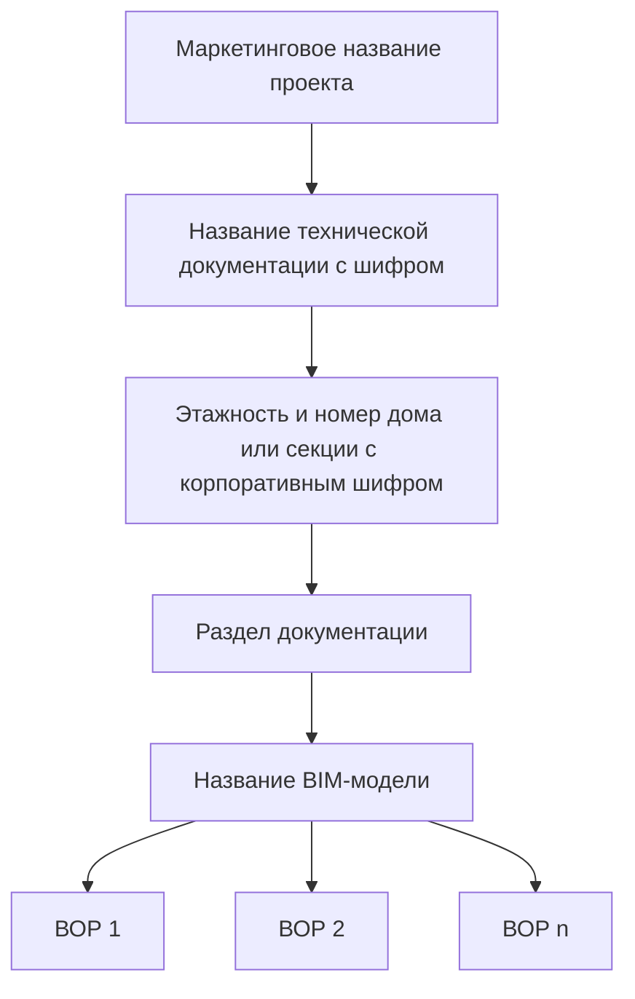

---
Контекст:
  - Бизнес
Проект:
  - "[[../01_Проекты/Инструкции Tangl (FAQ)]]"
Тег:
  - Информация
  - KPI
Технология:
  - Tangl
---
# О чем эта инструкция?
> - что такое **Входящие** и **Проекты**,
> - как BIM-модели попадают во **Входящие**,
> - как организована иерархия папок **Проекта**.
# Входящие и Проекты
После [[1. Начало работы|открытия программы]], вы окажетесь на главной странице⬇️

![[attachments/Входящие и Проекты.png]]
**Входящие** и **Проекты** находятся в левом верхнем углу.

> **Входящие** – это <u>сами 3D-модели</u>, загруженные в Tangl. Вы можете просматривать их отдельно, объединять по разделам, смотреть свойства элементов и многое другое. Большинство моделей разработано [ИКП](https://ikp-atom.ru/), часть создана другими проектировщиками, но все они предназначены для [Атомстройкомплекс](https://www.atomstroy.net/).

> **Проекты** – это <u>способ структурировать работу с 3D-моделями</u>. Они организуют специальные файлы - **результаты анализа** - в папки. **Результатами анализа** могут быть ВОР, постатейные бюджеты стадии П, сметы стадии Р, данные для эксплуатации и многое другое.

\* здесь и далее 3D-модель это просто модель
## Входящие

^26bc34

Нажмите на **Входящие** (1), чтобы отобразить список моделей справа (2)⬇️

![[attachments/Входящие_1.png]]

Отключите черную панель слева (3)⬇️ ^546d8f

![[attachments/Входящие_3.png]]

Теперь **Входящие** представлены в виде таблицы с заголовками⬇️ ^24c7e1

![[attachments/Входящие_2.png]]
Рассмотрим заголовки столбцов таблицы:
- **Версия** – это порядковый номер модели, загруженной в Tangl под тем же  именем. Например, модель **ИКП-036\_Бабушкина\_д.2Б\_Р\_КЖ1\_ФХ** регулярно обновляется: при каждом изменении BIM-отдел перезагружает модель, номер версии увеличивается.
- **Формат** - это тип BIM-модели. RVT - модель, созданная в Revit. IFC - модель в универсальном передаточном формате.
- **Модель или данные** - название модели, в которой работает проектировщик.
- **Покрытие** - количество значимых элементов с геометрией в модели.
- **Дата загрузки** - день и местное время, в которое модель была загружена в Tangl.
- **Автор** - электронная корпоративная почта специалиста, загрузившего модель в Tangl.
- **Описание** – текстовое описание модели. Обычно указывают название вида в Revit, с которого модель была выгружена, либо номер изменения. Если используется номер изменения, имя вида в Revit по умолчанию – **3D_Tangl**.
- **Действия** - возможные действия с моделью по порядку значков слева направо:
	1. Редактирование описания модели
	2. Открытие модели для просмотра
	3. Удаление модели (недоступно **аудитору**)
	4. Сравнение 2 моделей
	5. Поделиться с другим пользователем ссылкой на эту модель

> [!info] 
> О том, как инженер ПТО может работать во **Входящей** модели, вы можете прочитать в инструкции [[6. Продвинутые сценарии работы с 3D-моделью|продвинутые сценарии работы с 3D-моделью]].
## Проекты

> [!important] 
> Чаще всего название проекта совпадает с маркетинговым названием объекта продажи, например, **ЖК "Северное сияние"**. Если маркетинговое название неизвестно, используется рабочее наименование, например, **"Проект на Ирбитской"**. Также существуют:
> - **зарезервированные** проекты, именуемые по буквам греческого алфавита,
>  - **муниципальные** проекты,
>  - **подрядные коммерческие** проекты, которые не разрабатывает ИКП Атом,
>  - проект **модулей проектирования**.

Нажмите **Проекты** (1), чтобы увидеть список проектов справа (2)⬇️

![[attachments/Проекты_1.png]]

 При выборе любого проекта (3), на черном фоне слева появится папка верхнего уровня (4)⬇️

![[attachments/Проекты_2.png]]

На панели (5) расположены элементы управления уровнями раскрытия дерева папок и фильтр быстрого поиска. Поэкспериментируйте с этими кнопками⬇️

![[attachments/Проекты_3.png]]

> [!important] 
> Если у папки есть значок треугольника (6), значит папка содержит в себе другие папки или результаты анализа. Нажмите на него, чтобы Используйте его.

Иерархия дерева папок организована от **Проекта** к **Результату анализа**, которым обычно является **ведомость объемов работ (ВОР)**⬇️

# Что дальше?
Переходите к следующей инструкции: [[3. Поиск модели во Входящих|поиск модели во Входящих]].