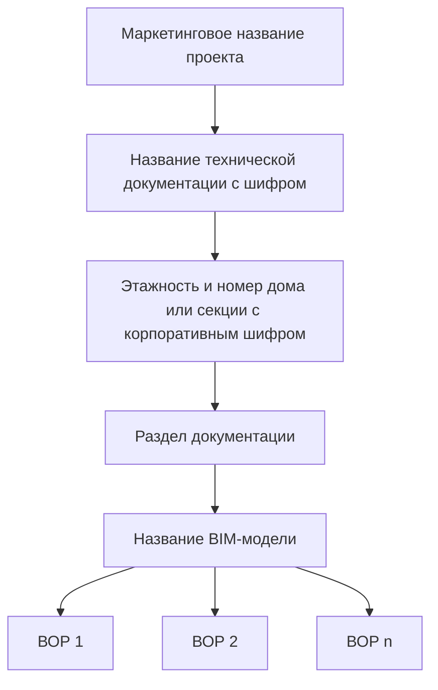

---
Контекст:
  - Бизнес
Проект:
  - "[[../01_Проекты/Инструкции Tangl (FAQ)]]"
Тег:
  - Информация
  - Работа
Технология:
  - Tangl
---
## 1. О чем эта инструкция?
> - что такое **входящие** и **проекты**,
> - как модели попадают во **входящие**,
> - как устроена иерархия папок **проекта**.
## 2. Входящие и проекты
После [[../00_Data/01_Задачи/Начало работы в Tangl Value|открытия программы]], вы окажетесь на **главной странице**.
В левом верхнем углу основные элементы - *Входящие* и *Проекты*
> **Входящие** – это все <u>BIM-модели</u>, загруженные в Tangl. Они нужны для того, чтоб получить 3D-представление об объекте. Большинство моделей разработано ИКП, часть создана другими проектировщиками, но все они предназначены для Атомстройкомплекс.

> **Проекты** – это все <u>проекты</u>, созданные в Tangl на основе **Входящих**. Они нужны для того, чтобы хранить в себе различные 3D-ведомости, и другие сведения о BIM-моделях. В Tangl они называются результаты анализа.
>
## 2.1. Входящие
Нажмите на *Входящие* (1), чтобы увидеть *список входящих моделей* (2) справа:

![[attachments/Входящие_1_BTW_WEB.png]]

> [!important] 
> В Tangl любая активная кнопка - синего цвета. Это значит, что нажав на такой элемент, можно его включить или выключить.

Воспользуемся рекомендацией ⬆️ и отключим (3) черную панель слева. Теперь *входящие* представлены в виде таблицы с заголовками:

![[attachments/Входящие_2_BTW_WEB.png]]

Рассмотрим заголовки столбцов таблицы:

| Версия | Формат | Модель или данные | Покрытие | Дата загрузки | Автор | Описание | Действия |
| ------ | ------ | ----------------- | -------- | ------------- | ----- | -------- | -------- |
- **Версия** – это порядковый номер модели, загруженной в Tangl под тем же  именем. Например, модель **ИКП-036\_Бабушкина\_д.2Б\_Р\_КЖ1\_ФХ** регулярно обновляется: при каждом изменении BIM-отдел перезагружает модель, номер версии увеличивается.
- **Формат** - это тип BIM-модели. RVT - модель, созданная в Revit. IFC - модель в универсальном передаточном формате.
- **Модель или данные** - название модели, в которой работает проектировщик.
- **Покрытие** - количество значимых элементов с геометрией в модели.
- **Дата загрузки** - день и местное время, в которое модель была загружена в Tangl.
- **Автор** - электронная корпоративная почта специалиста, загрузившего модель в Tangl.
- **Описание** – текстовое описание модели. Обычно указывают название вида в Revit, с которого модель была выгружена, либо номер изменения. Если используется номер изменения, имя вида по умолчанию – _3D_Tangl_. ^883941
- **Действия** - возможные действия с моделью. Включают:
	1. Редактирование **описания**
	2. Открытие модели для просмотра (так же доступно *двойным щелчком* на названии модели)
	3. Удаление модели
	4. Сравнение 2 моделей
	5. Поделиться ссылкой на модель с другим пользователем

> [!important] 
> О сценариях и фишках работы во *входящей модели* инженера ПТО вы можете прочитать в [[Что можно делать с BIM-моделью в Tangl Value WEB|этой инструкции]]. 
## 2.2. Проекты

> [!important] 
> Обычно название проекта совпадает с маркетинговым названием объекта продажи, например, **ЖК "Северное сияние"**. Если маркетинговое название неизвестно, используется рабочее наименование, например, **"Проект на Ирбитской"**. Также существуют:
> - *зарезервированные* проекты, именуемые по буквам греческого алфавита,
>  - *муниципальные* проекты,
>  - *подрядные коммерческие* проекты, которые не разрабатывает ИКП Атом,
>  - проект *модулей проектирования*.

Нажмите *Проекты* (1), чтобы увидеть *список проектов* (2) справа. При выборе любого *проекта* (3), слева на черном фоне появится папка верхнего уровня (4):

![[attachments/Проекты_1_BTW_WEB.png]]

Вы можете управлять глубиной открытия дерева папок *проекта* с помощью панели уровней с фильтром (1):

![[attachments/Проекты_2_BTW_WEB.png]]

> [!important] 
> Если у папки есть значок треугольника (2), значит папка содержит в себе другие папки или результаты анализа. Используйте его.

Иерархия дерева папок организована от *Проекта* к *Результату анализа*, которым обычно является **ведомость объемов работ**.

## 3. Что дальше?